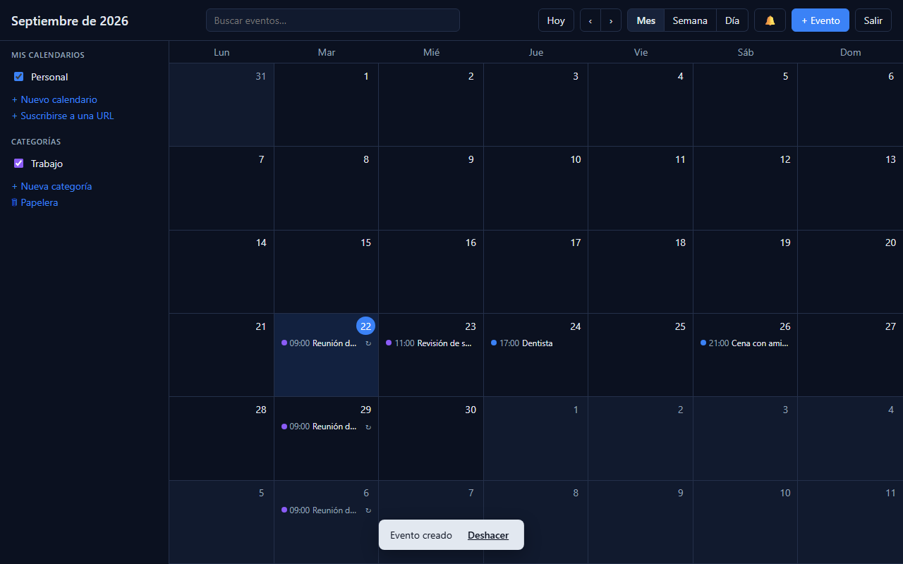
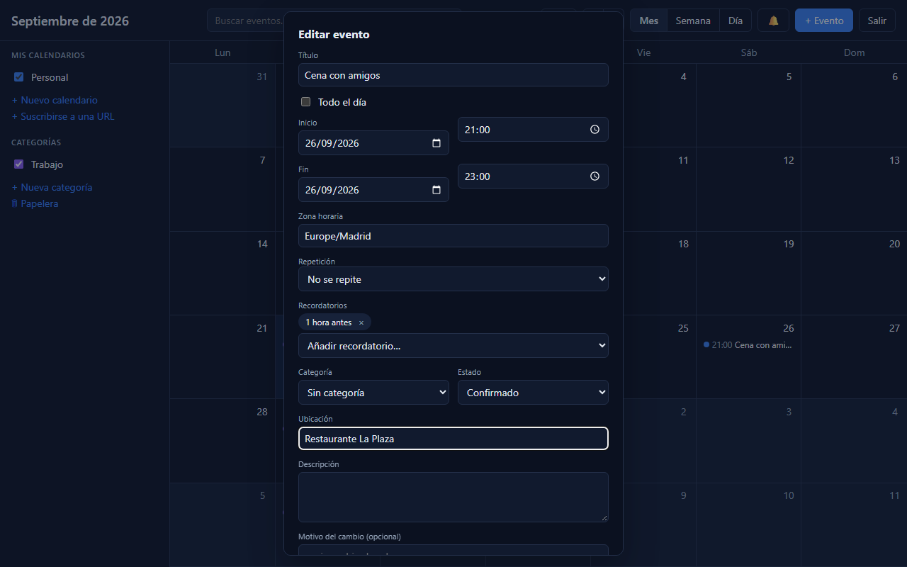

# Personal Calendar

Calendario personal con historial de versiones de eventos. Las decisiones de arquitectura están en
[`docs/`](docs/).

<p>
  
  
</p>

## Requisitos

- Node.js 24+
- pnpm 12 (`npm i -g pnpm`)
- Docker (para PostgreSQL)

## Puesta en marcha

```bash
pnpm install
cp .env.example .env
pnpm db:up          # PostgreSQL en docker (crea también la BD calendar_test)
pnpm migrate:up     # aplica migrations/
pnpm dev:api        # http://localhost:3000/health
pnpm dev:web        # http://localhost:5173 (proxy /api -> :3000)
```

La primera vez, crea tu cuenta en la pantalla de acceso (email y contraseña de 8+
caracteres). Cuando tengas la tuya, pon `REGISTRATION_OPEN=false` en `.env` para cerrar el
alta de cuentas nuevas. Detalles en [ADR-007](docs/decisions/007-authentication.md).

En la interfaz: **arrastra** un evento para moverlo (en semana/día también a otra
hora o día, con saltos de 15 min; con el teclado, flechas), **arrastra su borde inferior**
para cambiar la duración, y en la vista mensual arrástralo a otro día. Escape cancela; tras
cada cambio hay un aviso con «Deshacer» (salvo al tocar solo una ocurrencia de una serie, que
puede afectar a más de un evento a la vez). La barra lateral crea, renombra, recolorea y
archiva calendarios y categorías (**Papelera** al pie: eventos borrados, para restaurarlos) y
elige la **zona horaria de visualización** de las vistas.

**Repetición:** un evento puede repetirse cada N días, semanas (con los días que elijas),
meses o años (con «Nª ocurrencia de un día», p. ej. «el segundo martes»). Editar o borrar
ofrece elegir entre toda la serie, solo esa ocurrencia o esa ocurrencia y las siguientes
(ver [ADR-008](docs/decisions/008-recurrence.md) y
[ADR-013](docs/decisions/013-recurrence-exceptions.md)).
**Recordatorios:** «10 minutos antes», «1 día antes»… La campana de la barra muestra los
avisos pendientes y, si lo permites, el navegador también notifica
([ADR-009](docs/decisions/009-reminders.md): solo avisan con la aplicación abierta).
**Búsqueda:** el cuadro de la barra encuentra eventos por título, descripción o ubicación.
**Sesiones:** el botón «Sesiones» de la barra lista los inicios de sesión activos de la
cuenta y permite cerrarlos por separado.

**Importar, exportar y sincronizar** (⚙ junto a cada calendario): descarga o importa `.ics`; crea un
enlace de solo lectura para verlo en Google, Apple u Outlook; y con «Suscribirse a una URL» sigue
un calendario externo (p. ej. la «dirección secreta en formato iCal» de Google) como uno de solo
lectura que se mantiene al día. Detalles y límites en el [ADR-010](docs/decisions/010-interoperability.md).

**Compartir:** invita por email a otra persona (ya registrada) como lector o editor; ve la
invitación al entrar y la acepta. El historial muestra quién hizo cada cambio
([ADR-011](docs/decisions/011-shared-calendars.md)).

**Zona horaria por evento** en el formulario (independiente de la de visualización),
**panel de conflicto** si alguien cambió el evento mientras lo editabas, y **lectura y
escritura sin conexión** en la versión compilada (`pnpm build` y
`pnpm --filter @calendar/web preview`): crear, editar o borrar un evento suelto (no una
serie) funciona sin red y se envía solo al reconectar; si algo no se pudo aplicar (alguien
más lo cambió mientras tanto), se revisa desde el aviso que aparece. Ver
[ADR-012](docs/decisions/012-offline-conflicts-timezones.md) y
[ADR-016](docs/decisions/016-offline-write-queue.md).

## API

| Método y ruta                                      | Descripción                                                                                                                                 |
| -------------------------------------------------- | ------------------------------------------------------------------------------------------------------------------------------------------- |
| `POST /auth/register`                              | Crear cuenta e iniciar sesión (cookie `sid`); 409 si el email existe                                                                        |
| `POST /auth/login`                                 | Iniciar sesión; 401 genérico si los datos no son correctos                                                                                  |
| `POST /auth/logout`                                | Cerrar sesión; 204                                                                                                                          |
| `GET /auth/me`                                     | Usuario de la sesión actual                                                                                                                 |
| `GET /auth/sessions`                               | Sesiones activas de la cuenta (`current` marca la de esta petición)                                                                         |
| `DELETE /auth/sessions/:id`                        | Cierra una sesión propia; si es la actual, también borra la cookie                                                                          |
| `GET /health`                                      | Estado del servicio y de la base de datos                                                                                                   |
| `GET /calendars`                                   | Calendarios del usuario (incluye los archivados, con `archived`)                                                                            |
| `POST /calendars`                                  | Crear calendario (`name`, `color?`)                                                                                                         |
| `PATCH /calendars/:id`                             | Editar nombre, color o `archived` (no se pueden borrar; ver [ADR-015](docs/decisions/015-archive-calendars-categories.md))                  |
| `GET /calendars/:id/export.ics`                    | Descarga el calendario en formato `.ics` (cualquiera con acceso)                                                                            |
| `POST /calendars/:id/import`                       | Importa un `.ics` (`{ ics, timezone }`); por UID: crea, actualiza o deja igual                                                              |
| `GET/POST/DELETE /calendars/:id/feed`              | Estado, creación/regeneración y desactivación del enlace de suscripción (solo propietario)                                                  |
| `GET /feeds/<token>.ics`                           | **Público**, solo lectura: el enlace que se pega en Google/Apple/Outlook                                                                    |
| `POST /subscriptions`                              | Crea un calendario de solo lectura que refleja una URL `.ics`                                                                               |
| `POST /calendars/:id/sync`                         | Sincroniza ahora una suscripción; `DELETE /calendars/:id/subscription` la cancela                                                           |
| `GET/POST /calendars/:id/members`                  | Miembros e invitaciones de un calendario (solo propietario)                                                                                 |
| `PATCH/DELETE /calendars/:id/members/:userId`      | Cambiar permiso / quitar (o salir uno mismo)                                                                                                |
| `GET /invitations`                                 | Invitaciones pendientes que has recibido                                                                                                    |
| `POST /invitations/:calendarId/accept` / `decline` | Aceptar o rechazar una invitación                                                                                                           |
| `GET /categories`                                  | Categorías del usuario, por nombre (incluye las archivadas, con `archived`)                                                                 |
| `POST /categories`                                 | Crear categoría (`name`, `color?`); 409 si el nombre existe                                                                                 |
| `PATCH /categories/:id`                            | Renombrar, recolorear o archivar (`archived`); no se pueden borrar                                                                          |
| `GET /events?from=&to=`                            | Eventos que se solapan con `[from, to)` (máx. 400 d); las series se devuelven expandidas en ocurrencias. Filtros `calendarId`, `categoryId` |
| `GET /events/search?q=`                            | Busca en título, descripción y ubicación (sin acentos ni mayúsculas)                                                                        |
| `GET /events/:id`                                  | Un evento                                                                                                                                   |
| `POST /events`                                     | Crear evento (versión 1). Opcionales: `recurrence`, `categoryId`, `reminders`                                                               |
| `PATCH /events/:id`                                | Editar: crea una versión nueva; `expectedVersion` opcional; `reminders` no crea versión. `scope` (`this`/`following`) para una serie        |
| `DELETE /events/:id`                               | Borrado lógico (crea una versión con `deleted`); admite `scope` igual que `PATCH`; 204                                                      |
| `GET /events/trash`                                | Eventos borrados (versión vigente con `deleted`), más recientes primero                                                                     |
| `GET /events/:id/versions`                         | Historial (más reciente primero) con qué cambió en cada versión; funciona también con eventos borrados                                      |
| `GET /events/:id/versions/:version`                | Una versión concreta                                                                                                                        |
| `POST /events/:id/restore/:version`                | Restaurar: crea una versión nueva con ese contenido (también recupera un evento borrado); `expectedVersion` opcional                        |
| `GET /reminders/active`                            | Avisos activos ahora (su hora pasó y el evento no ha terminado)                                                                             |

Todas las rutas salvo `/health`, `/auth/register` y `/auth/login` exigen sesión (401 si no).
Los contratos (esquemas zod y DTOs) están en `packages/shared`. Errores:
`{ error, message, issues? }` con 400 (validación), 401, 403 (permiso de lector), 404, 409
(`version_conflict`, `calendar_read_only`) y 429.

## Comandos

| Comando                            | Qué hace                                       |
| ---------------------------------- | ---------------------------------------------- |
| `pnpm test`                        | Vitest. Los tests de BD requieren `pnpm db:up` |
| `pnpm lint` / `pnpm format:check`  | ESLint / Prettier                              |
| `pnpm typecheck`                   | `tsc --noEmit` en todos los paquetes           |
| `pnpm build`                       | Build del frontend                             |
| `pnpm migrate:create -- nombre`    | Nueva migración SQL en `migrations/`           |
| `pnpm migrate:up` / `migrate:down` | Aplica / revierte migraciones                  |

## Estructura

```
apps/api         API (Fastify) — monolito modular
apps/web         Frontend (React + Vite)
packages/domain  Lógica de dominio pura: eventos, versionado, recurrencia
packages/shared  Tipos compartidos entre API y web
migrations/      Migraciones SQL versionadas
tests/           Tests de integración (requieren PostgreSQL)
docs/            Arquitectura, modelo de datos y ADRs
```

## Despliegue

Imágenes Docker de producción para la API (`apps/api/Dockerfile`) y la web
(`apps/web/Dockerfile`, build estático servido por nginx con `/api/` reescrito hacia la
API). `docker-compose.prod.yml` las junta con PostgreSQL:

```
POSTGRES_PASSWORD=un-secreto REGISTRATION_OPEN=false \
  docker compose -f docker-compose.prod.yml up -d --build
```

Genérico todavía: sin proveedor de hosting elegido ni HTTPS (hace falta un proxy con TLS
delante de `web`; las cookies de sesión son `Secure` en `NODE_ENV=production`). Ver
comentarios en `docker-compose.prod.yml` y T-14/T-15 en las notas de la sesión.

Variables de entorno de producción: ver `.env.example` (todas tienen valor por defecto
salvo `DATABASE_URL`). Puntos a no olvidar:

- `TRUST_PROXY=true` solo si hay un proxy inverso de confianza delante (lo necesita el
  límite de intentos, que cuenta por IP).
- `REGISTRATION_OPEN=false` en cuanto exista tu cuenta, para que nadie más pueda crearse una.
- Copias de seguridad de PostgreSQL: `docker compose -f docker-compose.prod.yml exec db
pg_dump -U calendar calendar > backup.sql` (y `psql` para restaurar); no hay nada
  automatizado todavía, depende de dónde se despliegue.
- Logs: JSON por `stdout` (pino); el token del enlace de suscripción (`.ics` público) se
  redacta antes de escribirlo.

## Flujo de trabajo

- Rama `main` + ramas `feature/*`; commits pequeños.
- [Conventional Commits](https://www.conventionalcommits.org/): `feat:`, `fix:`, `test:`,
  `docs:`, `chore:`, `refactor:`…
- Todo cambio de esquema va en una migración nueva; nunca se edita una ya aplicada.
- Toda decisión de arquitectura relevante se registra como ADR en `docs/decisions/`.

## Licencia

[MIT](LICENSE)
